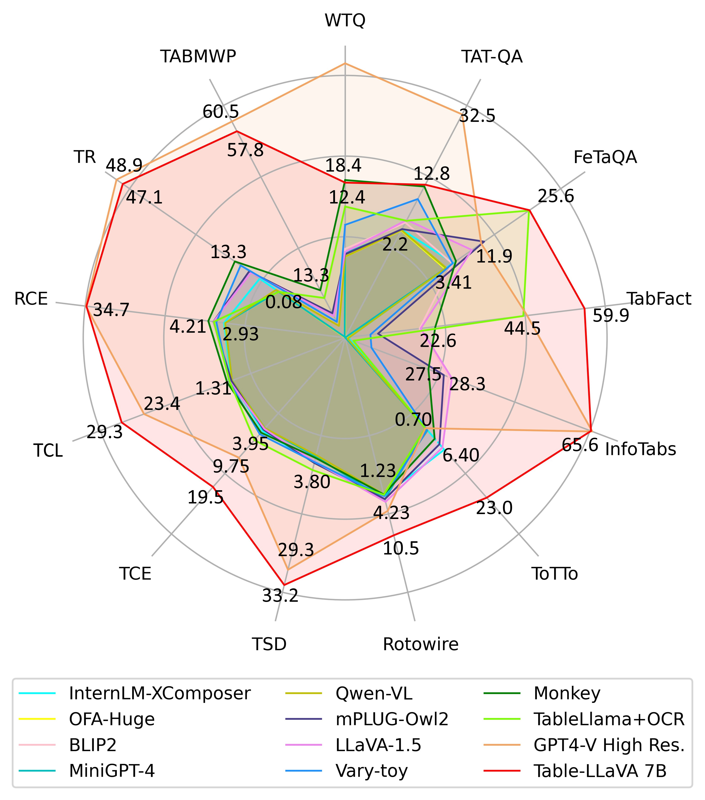
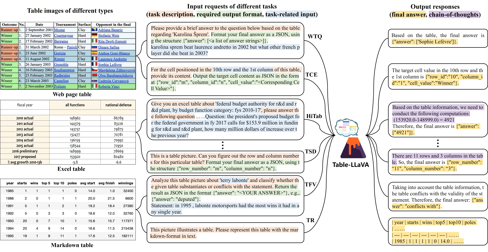

# Multimodal-Table-Understanding

[](https://arxiv.org/abs/2406.08100) [](https://huggingface.co/datasets/SpursgoZmy/MMTab) [](https://huggingface.co/SpursgoZmy/table-llava-v1.5-7b) [](https://github.com/haotian-liu/LLaVA)

## 1.Introduction



Although great progress has been made by recent LLM-based table understanding methods, they rely heavily on the premise that given tables must be converted into a certain text sequence (such as Markdown or HTML) to serve as model input. However, it is difficult to access high-quality textual table representations in some real-world scenarios like scanned documents and webpage screentshots, and table images are much more accessible. Therefore, how to directly understand tables using intuitive visual information
is a crucial and urgent challenge for developing more practical applications.

Facing the above challenge, we propose the multimodal table understanding problem, where the model is required to generate correct responses to different table-related requests (e.g., questions) in an end-to-end fashion based on the table image. Correspondingly, we construct **MMTab**, the first open-source large-scale dataset for multimodal table understanding problem, which can support both the training and evaluation of generalist MLLMs towards multimodal table understanding. Based on the curated MMTab dataset, we develop a versatile tabular MLLM named **Table-LLaVA** with an enhanced two-stage training paradigm of LLaVA v1.5. Table-LLaVA beats
strong MLLM baselines on 17 held-in and 6 held-out benchmarks, and is even competitive with the powerful GPT-4V on 14 benchmarks under a subset of test samples. The right figure shows an intuitive comparison of Table LLaVA 7B and existing MLLMs on various multimodal table understanding benchmarks.

## 2. Dataset Description
We constructed MMTab based on 14 publicly available table datasets of 8 domains. We carefully design scripts to convert original textual tables in these datasets into table images highlighting a broad coverage of table structures and styles, and transform all task-specific samples into multimodal instruction-tuning samples with a unified format of ```<table image, input request,
output response>```. The resulting dataset contains three parts and can be downloaded from the [Hugging Face Dataset](https://huggingface.co/datasets/SpursgoZmy/MMTab). During the dataset
construction, data augmentations at multiple levels (e.g., table-level, task-level) were adopted to further improve the data diversity.

| Dataset Split | #Table Images | #Sample |
| :---: | :---: | :---: |
| **MMTab-pre** | 97K | 150K table recognition samples for pre-training |
| **MMTab-instruct** | 82K | 232K samples of 14 table-based tasks for instruction-tuning |
| **MMTab-eval** | 23K | 45K samples of 17 held-in benchmarks and 4K samples of 7 held-out benchmarks for evaluation |

Dataset examples are shown in the following figure and more examples are shown in the Appendix A in the original paper.

<div align=center>

</div>

## 3. Model Weights

## 4. Training

## 5. Inference

## 6. Evaluation

## 7. Limitations

## TODOs
- [x] Upload the MMTab dataset to Hugging Face.
- [x] Upload the Table LLaVA 7B and 13B model weights to Hugging Face.
- [ ] Upload the code for model training.
- [ ] Upload the code for model inference.
- [ ] Upload the code for evaluation.

## Citation
```bibtex
@misc{zheng2024multimodal,
      title={Multimodal Table Understanding}, 
      author={Mingyu Zheng and Xinwei Feng and Qingyi Si and Qiaoqiao She and Zheng Lin and Wenbin Jiang and Weiping Wang},
      year={2024},
      eprint={2406.08100},
      archivePrefix={arXiv},
      }
}
```
